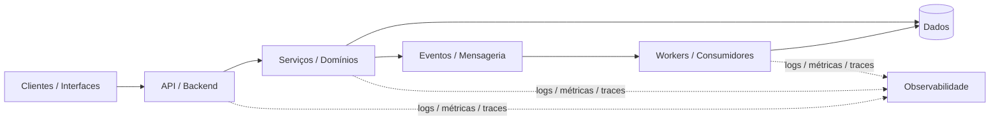

<div align="center">

# Iury Gregory

### Engenheiro de Software · Backend · Sistemas Distribuídos · Cloud

Meu foco é **engenharia backend e server-side**: APIs, serviços, sistemas distribuídos, mensageria, cloud, observabilidade e arquitetura.

[](https://www.iurygregory.com.br)
[](https://www.linkedin.com/in/iury-gregory-com-br)
[](https://wakatime.com/@iurygregory)

</div>

---

## Sobre mim

Sou engenheiro de software com **foco principal em backend**. Minha maior profundidade está no desenvolvimento de aplicações server-side, APIs, microserviços, sistemas distribuídos, plataformas cloud e integrações entre serviços.

Não me posiciono como desenvolvedor full stack. Tenho experiência suficiente em frontend para **construir interfaces, integrar aplicações com APIs e entregar fluxos completos quando necessário**, mas minha especialidade, interesse e maior profundidade técnica continuam sendo o backend e a arquitetura por trás dos sistemas.

No lado servidor, gosto de trabalhar desde os limites entre serviços e domínios até persistência, mensageria, segurança, contratos de API, observabilidade, testes, automação de entrega e operação em produção.

No frontend, já desenvolvi aplicações com **React, TypeScript, Vite, Material UI, Next.js e Angular**, incluindo integração com REST e GraphQL, comunicação em tempo real, testes automatizados, acessibilidade e validações de qualidade. Vejo essa experiência como uma competência complementar que me ajuda a compreender melhor o produto e os consumidores das APIs que construo.

Grande parte dos projetos que representam essa evolução técnica é privada. Por isso, este perfil apresenta apenas **tecnologias, padrões, conceitos arquiteturais e áreas de estudo de forma agregada**, sem expor nomes, regras de negócio, clientes, estruturas internas ou detalhes identificáveis desses repositórios.

Minha trajetória profissional completa está disponível no **LinkedIn** e no **portfólio**, acessíveis pelos links no topo do perfil.

---

## Foco técnico

### ⚙️ Backend & Server-side

Desenvolvimento de serviços, APIs e aplicações backend com atenção a **modelagem, contratos, persistência, segurança, testabilidade, desempenho e operação em produção**.

`Kotlin` · `Java` · `Spring / Spring Boot` · `Node.js` · `TypeScript` · `NestJS` · `Fastify` · `REST` · `GraphQL` · `OpenAPI`

### 🧩 Sistemas Distribuídos

Desenho e desenvolvimento de serviços com preocupação em **resiliência, escalabilidade, disponibilidade, limites claros entre domínios e comunicação entre componentes**.

`Microservices` · `REST` · `GraphQL` · `WebSockets` · `Comunicação síncrona` · `Comunicação assíncrona`

### 📨 Arquitetura orientada a eventos

Uso e estudo de mensageria para desacoplar workloads, integrar serviços e construir fluxos mais resilientes.

`Kafka` · `RabbitMQ` · `AWS SQS` · `AWS SNS` · `Transactional Outbox` · `Event-driven Architecture`

### ☁️ Cloud & Plataforma

Desenvolvimento consciente da infraestrutura, com aplicações containerizadas, orquestração, serviços gerenciados e automação de entrega.

`AWS` · `Kubernetes` · `Docker` · `Google Cloud` · `Linux` · `CI/CD`

### 📈 Observabilidade & Confiabilidade

Gosto de sistemas que possam ser compreendidos também depois que entram em produção: logs, métricas, traces, health checks e diagnósticos operacionais fazem parte da arquitetura.

`Datadog` · `Grafana` · `Elastic Observability` · `OpenTelemetry` · `Logs` · `Métricas` · `Tracing`

---

## Frontend como competência complementar

Embora não seja meu foco principal, consigo desenvolver e manter interfaces modernas quando o contexto exige. Essa experiência também me ajuda a projetar APIs e contratos mais adequados aos consumidores.

Já trabalhei com:

- aplicações em **React + TypeScript**;
- projetos com **Vite** e **Next.js**;
- interfaces com **Material UI** e arquitetura baseada em componentes;
- consumo de **REST e GraphQL**, incluindo Apollo Client e geração de contratos;
- comunicação em tempo real com **Socket.IO / WebSockets**;
- testes com **Vitest, Playwright e Testing Library**;
- acessibilidade e verificações automatizadas de interface;
- PWA, responsividade, internacionalização e quality gates de frontend.

<p>
  <a href="https://react.dev/" title="React"></a>
  <a href="https://www.typescriptlang.org/" title="TypeScript"></a>
  <a href="https://nextjs.org/" title="Next.js"></a>
  <a href="https://angular.dev/" title="Angular"></a>
  <a href="https://vite.dev/" title="Vite"></a>
  <a href="https://mui.com/" title="Material UI"></a>
</p>

`React` · `TypeScript` · `Next.js` · `Angular` · `Vite` · `Material UI`

### Mobile

Também tenho experiência e estudos em aplicações mobile e multiplataforma, principalmente para integração com serviços e construção de produtos completos quando necessário.

`React Native` · `Expo` · `Flutter` · `Ionic` · `Android` · `Kotlin`

---

## Stack tecnológica

> Os ícones abaixo direcionam para o site ou documentação oficial de cada tecnologia.

### Linguagens

<p>
  <a href="https://kotlinlang.org/" title="Kotlin"></a>
  <a href="https://www.java.com/" title="Java"></a>
  <a href="https://www.typescriptlang.org/" title="TypeScript"></a>
  <a href="https://www.python.org/" title="Python"></a>
  <a href="https://www.php.net/" title="PHP"></a>
  <a href="https://developer.mozilla.org/docs/Web/JavaScript" title="JavaScript"></a>
</p>

`Kotlin` · `Java` · `TypeScript` · `Python` · `PHP` · `JavaScript`

### Backend & APIs

<p>
  <a href="https://spring.io/" title="Spring"></a>
  <a href="https://nodejs.org/" title="Node.js"></a>
  <a href="https://nestjs.com/" title="NestJS"></a>
  <a href="https://expressjs.com/" title="Express"></a>
  <a href="https://laravel.com/" title="Laravel"></a>
  <a href="https://www.djangoproject.com/" title="Django"></a>
  <a href="https://graphql.org/" title="GraphQL"></a>
</p>

`Spring / Spring Boot` · `Node.js` · `NestJS` · `Fastify` · `Express` · `Laravel` · `Django` · `REST` · `GraphQL` · `OpenAPI`

### Dados & Persistência

<p>
  <a href="https://www.postgresql.org/" title="PostgreSQL"></a>
  <a href="https://redis.io/" title="Redis"></a>
  <a href="https://www.prisma.io/" title="Prisma"></a>
  <a href="https://www.mysql.com/" title="MySQL"></a>
  <a href="https://www.mongodb.com/" title="MongoDB"></a>
</p>

`PostgreSQL` · `SQL` · `NoSQL` · `Prisma` · `Redis` · `MySQL` · `MongoDB`

### Cloud, DevOps & Plataforma

<p>
  <a href="https://aws.amazon.com/" title="AWS"></a>
  <a href="https://cloud.google.com/" title="Google Cloud"></a>
  <a href="https://kubernetes.io/" title="Kubernetes"></a>
  <a href="https://www.docker.com/" title="Docker"></a>
  <a href="https://www.kernel.org/" title="Linux"></a>
  <a href="https://www.jenkins.io/" title="Jenkins"></a>
  <a href="https://github.com/features/actions" title="GitHub Actions"></a>
</p>

`AWS` · `Google Cloud` · `Kubernetes` · `Docker` · `Linux` · `Jenkins` · `GitHub Actions` · `CircleCI` · `AWS CodePipeline`

### Mensageria & comunicação em tempo real

<p>
  <a href="https://kafka.apache.org/" title="Apache Kafka"></a>
  <a href="https://www.rabbitmq.com/" title="RabbitMQ"></a>
</p>

`Kafka` · `RabbitMQ` · `AWS SQS` · `AWS SNS` · `WebSockets` · `Socket.IO`

### Qualidade & Testes

<p>
  <a href="https://jestjs.io/" title="Jest"></a>
  <a href="https://vitest.dev/" title="Vitest"></a>
  <a href="https://playwright.dev/" title="Playwright"></a>
</p>

`JUnit` · `Jest` · `Vitest` · `Playwright` · `Testing Library` · `Type Checking` · `Linting` · `Prettier` · `Dependency Auditing`

### Frontend & Mobile — complementar

<p>
  <a href="https://react.dev/" title="React"></a>
  <a href="https://nextjs.org/" title="Next.js"></a>
  <a href="https://angular.dev/" title="Angular"></a>
  <a href="https://vite.dev/" title="Vite"></a>
  <a href="https://mui.com/" title="Material UI"></a>
  <a href="https://flutter.dev/" title="Flutter"></a>
</p>

`React` · `Next.js` · `Angular` · `React Native` · `Expo` · `Vite` · `Material UI` · `Flutter` · `Ionic`

---

## Arquitetura & práticas de engenharia

Mais do que escolher frameworks, procuro trabalhar com princípios que mantenham sistemas compreensíveis e sustentáveis conforme crescem.



> Diagrama apenas conceitual. Não representa a arquitetura de nenhum empregador, cliente ou projeto privado.

Princípios, padrões e práticas com os quais trabalho ou estudo:

- **Sistemas distribuídos** e limites claros entre serviços
- **Clean Architecture** e separação de responsabilidades
- **Domain-oriented design** e organização por domínios
- **Repository Pattern** e abstração de persistência
- **Arquitetura orientada a eventos**
- **Comunicação assíncrona** e mensageria
- **Transactional Outbox** e entrega confiável de eventos
- **APIs REST e GraphQL**
- **Contract-first / schema-first** com OpenAPI e GraphQL Codegen
- **Autenticação, autorização, roles e permissions**
- **WebSockets e comunicação em tempo real**
- **Resiliência, escalabilidade e alta disponibilidade**
- **Observabilidade com logs, métricas e tracing**
- **Containerização e orquestração**
- **CI/CD e quality gates automatizados**
- **Testes unitários, integração, contratos e E2E**
- **Segurança de dependências e validações automatizadas**

---

## Como penso software

```text
Backend sólido             > lógica espalhada entre camadas
Limites claros             > acoplamento acidental
Contratos explícitos       > integrações implícitas
Automação                  > processos manuais repetitivos
Observabilidade            > depuração por tentativa e erro
Resiliência                > depender do caminho feliz
Código sustentável         > código apenas sofisticado
Fundamentos                > apego a frameworks
```

---

## Tecnologias e temas que também explorei

Ao longo dos anos, usei projetos pessoais, provas de conceito e estudos para explorar diferentes tecnologias e paradigmas.

`Laravel` · `.NET Core` · `Django REST Framework` · `Spring Boot` · `NestJS` · `React Native` · `Flutter` · `Ionic` · `Firebase` · `Computer Vision` · `Face Detection` · `Face Recognition` · `Docker` · `RabbitMQ` · `GraphQL`

A ideia não é colecionar ferramentas, mas entender diferentes abordagens e incorporar o que faz sentido em sistemas reais.

---

## O que valorizo em engenharia

- backends previsíveis, observáveis e simples de operar;
- decisões arquiteturais com contexto e trade-offs claros;
- contratos bem definidos entre serviços e clientes;
- automação desde desenvolvimento local até produção;
- feedback rápido por testes, métricas e observabilidade;
- segurança e confiabilidade como parte da engenharia;
- melhoria contínua de código, arquitetura e processos;
- tecnologia escolhida pelo problema, não pelo hype.

---

<div align="center">

### Backend, sistemas distribuídos e cloud como especialidade — frontend como ferramenta complementar para entregar produtos melhores.

</div>
