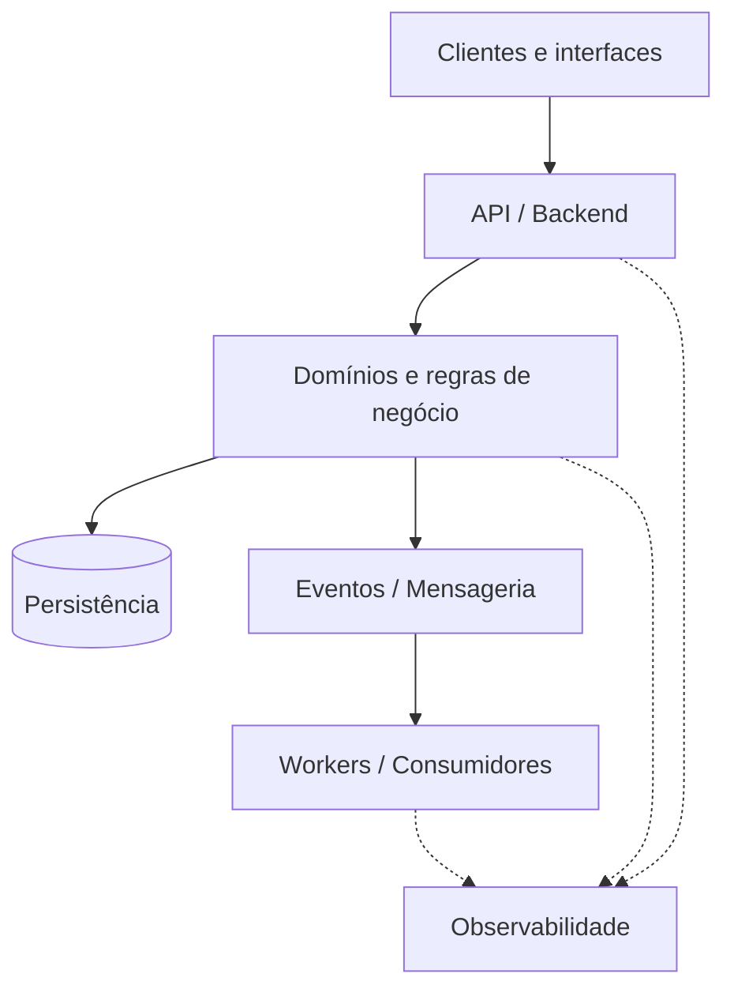

# Iury Gregory

### Engenheiro de Software · Backend · Sistemas Distribuídos · Cloud

APIs, serviços e integrações com atenção a **confiabilidade, operação e evolução dos sistemas**.

## Sobre mim

Sou engenheiro de software com foco em **backend e aplicações server-side**. Trabalho com APIs, microserviços, sistemas distribuídos, mensageria e cloud, considerando desde a modelagem dos domínios e a persistência até segurança, testes, observabilidade e operação em produção.

Frontend é uma **competência complementar**: consigo construir interfaces e integrá-las aos serviços que desenvolvo. Essa experiência me ajuda a compreender os consumidores das APIs e os fluxos do produto.

Minha trajetória profissional está no LinkedIn e no portfólio, pelos links no topo. Aqui reúno tecnologias e práticas de projetos e estudos, sem expor detalhes de repositórios privados.

## Backend, dados e plataforma

### Linguagens e APIs

  
  
  
  
  
  
  

**Kotlin · Java · Spring / Spring Boot · TypeScript · Node.js · NestJS · GraphQL**

Também utilizo Fastify e Express no ecossistema Node.js, além de REST e OpenAPI para definição e documentação de APIs.

### Dados e persistência

  
  
  
  
  

**PostgreSQL · Redis · Prisma · MySQL · MongoDB**

Modelagem de dados, SQL, NoSQL, cache e abstração de persistência conforme as necessidades da aplicação.

### Mensageria e integrações

  
  

**Apache Kafka · RabbitMQ · AWS SQS · AWS SNS**

Comunicação síncrona e assíncrona entre serviços, arquitetura orientada a eventos e estudo de padrões como Transactional Outbox. Para comunicação em tempo real, WebSockets e Socket.IO.

### Cloud e entrega

  
  
  
  
  
  
  

**AWS · Google Cloud · Kubernetes · Docker · Linux · Jenkins · GitHub Actions**

Aplicações containerizadas, orquestração e automação de entrega. O repertório de CI/CD também inclui CircleCI e AWS CodePipeline.

### Observabilidade e qualidade

**Datadog · Grafana · Elastic Observability · OpenTelemetry**

Logs, métricas, traces e health checks para acompanhar o comportamento das aplicações e investigar falhas.

  
  
  

**JUnit · Jest · Vitest · Playwright · Testing Library**

Testes unitários, de integração, de contratos e E2E, com verificações de tipos, lint, formatação e dependências nas rotinas de CI/CD.

## Arquitetura e práticas de engenharia

Nos projetos e estudos, procuro relacionar cada prática ao problema que ela ajuda a resolver:

- **Limites de domínio e separação de responsabilidades:** Clean Architecture, organização por domínios e Repository Pattern para tornar regras de negócio e persistência mais compreensíveis e testáveis.
- **Contratos explícitos:** REST, OpenAPI, GraphQL e GraphQL Codegen para alinhar serviços e consumidores, com abordagens contract-first ou schema-first conforme o contexto.
- **Integrações confiáveis:** mensageria e Transactional Outbox para explorar desacoplamento e consistência na publicação de eventos.
- **Segurança:** autenticação, autorização e controle de acesso por papéis e permissões, acompanhados de validações automatizadas.
- **Operação e evolução:** observabilidade, testes e automação de entrega, com decisões de arquitetura orientadas aos requisitos de resiliência, escala e disponibilidade.

<strong>Exemplo conceitual de interação entre componentes</strong>

O desenho abaixo ilustra uma combinação possível de APIs, processamento assíncrono e observabilidade. Não representa a arquitetura de um empregador, cliente ou projeto privado.

As setas pontilhadas representam logs, métricas e traces. O diagrama omite limites de implantação, mecanismos de publicação de eventos e detalhes de persistência dos consumidores.

## Frontend como competência complementar

  
  
  
  
  

**React · Next.js · Angular · Vite · Material UI**, com TypeScript.

Já desenvolvi interfaces com componentes reutilizáveis, consumo de REST e GraphQL com Apollo Client, comunicação em tempo real e testes automatizados. Essa atuação também inclui responsividade, acessibilidade, internacionalização e PWA.

## Outras tecnologias e estudos

<strong>Linguagens, frameworks, mobile e temas explorados</strong>

Meu repertório também inclui projetos pessoais, provas de conceito e estudos com as tecnologias abaixo. Elas complementam meu foco em backend e representam diferentes níveis de prática e aprofundamento.

  
  
  
  
  

- **Linguagens e frameworks:** Python, PHP, JavaScript, Laravel, Django REST Framework e .NET Core.
- **Mobile e multiplataforma:** React Native, Expo, Flutter, Ionic e Android com Kotlin.
- **Outros temas:** Firebase, visão computacional, detecção e reconhecimento facial.

---

Valorizo contratos claros, código sustentável, feedback rápido e sistemas simples de operar. As decisões de arquitetura partem do problema, dos requisitos e dos custos de manter a solução.
